# Suggested Answers {#SuggestedAnswers}

이 부록은 이 책의 예제에 대한 제안된 답변을 포함한다.


## 공통 데이터 모델 {#Cdmanswers}

#### 예제 \@ref(exr:exerciseJohnPerson) {-}

예제의 설명에 기반하여, John의 기록은 표 \@ref(tab:johnPerson)처럼 보여야 한다.

Table: (\#tab:johnPerson) The PERSON table.

Column name|Value|Explanation
:---------------------|:-----------|:--------------------------------------
|PERSON_ID|2|A unique integer.|
|GENDER_CONCEPT_ID|8507|The concept ID for male gender is [8507](http://athena.ohdsi.org/search-terms/terms/8507).|
|YEAR_OF_BIRTH|1974||
|MONTH_OF_BIRTH|8||
|DAY_OF_BIRTH|4||
|BIRTH_DATETIME|1974-08-04 00:00:00|When the time is not known midnight is used.|
|DEATH_DATETIME|NULL||
|RACE_CONCEPT_ID|8516|The concept ID for black or African American is [8516](http://athena.ohdsi.org/search-terms/terms/8516).|
|ETHNICITY_ CONCEPT_ID|38003564| [38003564](http://athena.ohdsi.org/search-terms/terms/38003564) refers to "Not hispanic".|
|LOCATION_ID||His address is not known.|
|PROVIDER_ID||His primary care Provider is not known.|
|CARE_SITE||His primary Care Site is not known.|
|PERSON_SOURCE_ VALUE|NULL|Not provided.|
|GENDER_SOURCE_ VALUE|Man|The text used in the description.|
|GENDER_SOURCE_ CONCEPT_ID|0||
|RACE_SOURCE_ VALUE|African American|The text used in the description.|
|RACE_SOURCE_ CONCEPT_ID|0||
|ETHNICITY_SOURCE_ VALUE|NULL||
|ETHNICITY_SOURCE_ CONCEPT_ID|0||

#### 예제 \@ref(exr:exerciseJohnOp) {-}

예제의 설명에 기반하여, John의 기록은 표 \@ref(tab:johnOp) 처럼 보여야 한다.

Table: (\#tab:johnOp) The OBSERVATION_PERIOD table.

Column name|Value|Explanation
:----------------------|:----------|:--------------------------------------
|OBSERVATION_ PERIOD_ID|2|A unique integer.|
|PERSON_ID|2|This is a foreign key to John's record in the PERSON table.|
|OBSERVATION_PERIOD_ START_DATE|2015-01-01|The date of enrollment.|
|OBSERVATION_PERIOD_ END_DATE|2019-07-01|No data can be expected after the data extraction date.|
|PERIOD_TYPE_ CONCEPT_ID|44814722| [44814724](http://athena.ohdsi.org/search-terms/terms/44814722) refers to "Period while enrolled in insurance".|

#### 예제 \@ref(exr:exerciseJohnDrug) {-}

예제의 설명에 기반하여, John의 기록은 표 \@ref(tab:johnDrug) 처럼 보여야 한다.

Table: (\#tab:johnDrug) The DRUG_EXPOSURE table.

Column name|Value|Explanation
:---------------------|:-----------|:--------------------------------------
|DRUG_EXPOSURE_ID|1001|Some unique integer|
|PERSON_ID|2|This is a foreign key to John's record in the PERSON table.|
|DRUG_CONCEPT_ID|19078461|The provided NDC code maps to Standard Concept [19078461](http://athena.ohdsi.org/search-terms/terms/19078461).|
|DRUG_EXPOSURE_ START_DATE|2019-05-01|The start date of the exposure to the drug.|
|DRUG_EXPOSURE_ START_DATETIME|2019-05-01 00:00:00|Midnight is used as the time is not known.|
|DRUG_EXPOSURE_ END_DATE|2019-05-31|Based on start date + days supply.|
|DRUG_EXPOSURE_ END_DATETIME|2019-05-31 00:00:00|Midnight is used as time is unknown.|
|VERBATIM_END_DATE|NULL|Not provided.|
|DRUG_TYPE_ CONCEPT_ID|38000177| [38000177](http://athena.ohdsi.org/search-terms/terms/38000177) indicates "Prescription written".|
|STOP_REASON|NULL||
|REFILLS|NULL||
|QUANTITY|NULL|Not provided.|
|DAYS_SUPPLY|30|As described in the exercise.|
|SIG|NULL|Not provided.|
|ROUTE_CONCEPT_ID|4132161| [4132161](http://athena.ohdsi.org/search-terms/terms/4132161) indicates "Oral".|
|LOT_NUMBER|NULL|Not provided.|
|PROVIDER_ID|NULL|Not provided.|
|VISIT_OCCURRENCE_ ID|NULL|No information on the visit was provided..|
|VISIT_DETAIL_ID|NULL||
|DRUG_SOURCE_ VALUE|76168009520|This is provided NDC code.|
|DRUG_SOURCE_ CONCEPT_ID|583945| [583945](http://athena.ohdsi.org/search-terms/terms/750264) represents the drug source value (NDC code "76168009520").|
|ROUTE_SOURCE_ VALUE|NULL||

#### 예제 \@ref(exr:exerciseGiBleedRecords) {-}

기록의 세트를 찾기 위해서, 우리는 테이블 CONDITION_OCCURRENCE를 쿼리할 수 있다:


```r
library(DatabaseConnector)
connection <- connect(connectionDetails)
sql <- "SELECT *
FROM @cdm.condition_occurrence
WHERE condition_concept_id = 192671;"

result <- renderTranslateQuerySql(connection, sql, cdm = "main")
head(result)
```

```
##   CONDITION_OCCURRENCE_ID PERSON_ID CONDITION_CONCEPT_ID ...
## 1                    4657       273               192671 ...
## 2                    1021        61               192671 ...
## 3                    5978       351               192671 ...
## 4                    9798       579               192671 ...
## 5                    9301       549               192671 ...
## 6                    1997       116               192671 ...
```

#### 예제 \@ref(exr:exercisePersonSource) {-}

기록의 세트를 찾기 위해서, CONDITION_SOURCE_VALUE 필드를 사용하여 테이블 CONDITION_OCCURRENCE를 쿼리할 수 있다:


```r
sql <- "SELECT *
FROM @cdm.condition_occurrence
WHERE condition_source_value = 'K92.2';"

result <- renderTranslateQuerySql(connection, sql, cdm = "main")
head(result)
```

```
##   CONDITION_OCCURRENCE_ID PERSON_ID CONDITION_CONCEPT_ID ...
## 1                    4657       273               192671 ...
## 2                    1021        61               192671 ...
## 3                    5978       351               192671 ...
## 4                    9798       579               192671 ...
## 5                    9301       549               192671 ...
## 6                    1997       116               192671 ...
```

#### 예제 \@ref(exr:exercisePerson61Records) {-}

이 정보는 테이블 OBSERVATION_PERIOD에 저장되어 있다:


```r
library(DatabaseConnector)
connection <- connect(connectionDetails)
sql <- "SELECT *
FROM @cdm.observation_period
WHERE person_id = 61;"

renderTranslateQuerySql(connection, sql, cdm = "main")
```

```
##   OBSERVATION_PERIOD_ID PERSON_ID OBSERVATION_PERIOD_START_DATE ...
## 1                    61        61                    1968-01-21 ...
```


## OMOP 표준 용어 {#Vocabanswers}

#### 예제 \@ref(exr:exerciseVocab1) {-}

Concept ID 192671 ("Gastrointestinal hemorrhage")

#### 예제 \@ref(exr:exerciseVocab2) {-}

ICD-10CM 코드:

- K29.91 "Gastroduodenitis, unspecified, with bleeding"
- K92.2 "Gastrointestinal hemorrhage, unspecified"

ICD-9CM 코드:

- 578 "Gastrointestinal hemorrhage"
- 578.9 "Hemorrhage of gastrointestinal tract, unspecified"

#### 예제 \@ref(exr:exerciseVocab3) {-}

MedDRA의 선호되는 용어:

- "Gastrointestinal haemorrhage" (Concept ID 35707864)
- "Intestinal haemorrhage" (Concept ID 35707858)


## 추출 변환 적재 {#Etlanswers}

#### 예제 \@ref(exr:exerciseEtl1) {-}

A) 데이터 전문가와 CDM 전문가가 함께 ETL을 설계할 것
C) 의학 지식이 있는 사람들이 코드 매핑을 할 것
B) 기술자가 ETL을 수행할 것
D) 모든 사람이 질 관리에 참여할 것

#### 예제 \@ref(exr:exerciseEtl2) {-}

Column | Value | Answer
:---------------- |:----------- |:-----------------------
PERSON_ID | A123B456 | This column has a data type of integer so the source record value needs to be translated to a numeric value.
GENDER_CONCEPT_ID | 8532 | 
YEAR_OF_BIRTH | NULL | If we do not know the month or day of birth, we do not guess. A person can exist without a month or day of birth. If a person lacks a birth year that person should be dropped.  This person would have to be dropped due to now year of birth.
MONTH_OF_BIRTH | NULL | 
DAY_OF_BIRTH | NULL | 
RACE_CONCEPT_ID | 0 | The race is WHITE which should be mapped to 8527.
ETHNICITY_CONCEPT_ ID | 8527 | No ethnicity was provided, this should be mapped to 0.
PERSON_SOURCE_ VALUE | A123B456 | 
GENDER_SOURCE_ VALUE | F | 
RACE_SOURCE_VALUE | WHITE | 
ETHNICITY_SOURCE_ VALUE | NONE PROVIDED | 

#### 예제 \@ref(exr:exerciseEtl3) {-}

Column | Value
:------------------------ |:------------- 
VISIT_OCCURRENCE_ID | 1
PERSON_ID | 11
VISIT_START_DATE | 2004-09-26
VISIT_END_DATE | 2004-09-30
VISIT_CONCEPT_ID | 9201
VISIT_SOURCE_VALUE | inpatient


## 데이터 분석 이용 사례 {#UseCasesanswers}

#### 예제 \@ref(exr:exerciseUseCases1) {-}

1. 임상적 특성 분석

2. 환자 수준 예측

3. 인구 수준 추정

#### 예제 \@ref(exr:exerciseUseCases2) {-}

아마 아닐 것이다. 디클로페낙 diclofenac 노출 코호트와 비교할 수 있는 비노출 코호트를 정의한다는 것은 보통 불가능한데 이는 사람들이 각각의 이유가 있어 디클로페낙을 복용하기 때문이다. 이것은 사람 간의 비교를 금지한다. 사람 내 비교가 가능할 수는 있어서, 디클로페낙 코호트 안의 각각의 환자는 그들이 노출되지 않았을 때의 시간을 정의할 수 있다. 그러나, 비슷한 문제가 여기서 발생한다: 이런 시기는 비교가 되지 않는다. 왜냐하면 어떤 때 누군가는 노출되고, 누군가는 노출이 되지 않는 이유에서다.


## SQL과 R {#SqlAndRanswers}

#### 예제 \@ref(exr:exercisePeopleCount) {-}

간단하게 테이블 PERSON을 쿼리하여 사람의 수를 계산하기 위해서는:


```r
library(DatabaseConnector)
connection <- connect(connectionDetails)
sql <- "SELECT COUNT(*) AS person_count
FROM @cdm.person;"

renderTranslateQuerySql(connection, sql, cdm = "main")
```

```
##   PERSON_COUNT
## 1         2694
```

#### 예제 \@ref(exr:exerciseCelecoxibUsers) {-}

최소 한 번이라도 celecoxib의 처방을 받은 사람의 수를 계산하기 위해서, 테이블 DRUG_EXPOSURE를 쿼리할 수 있다. 성분 celecoxib을 포함하는 모든 약물을 찾기 위해서, 우리는 테이블 CONCEPT_ANCESTOR과 CONCEPT를 조인해야 한다:


```r
library(DatabaseConnector)
connection <- connect(connectionDetails)
sql <- "SELECT COUNT(DISTINCT(person_id)) AS person_count
FROM @cdm.drug_exposure
INNER JOIN @cdm.concept_ancestor
  ON drug_concept_id = descendant_concept_id
INNER JOIN @cdm.concept ingredient
  ON ancestor_concept_id = ingredient.concept_id
WHERE LOWER(ingredient.concept_name) = 'celecoxib'
  AND ingredient.concept_class_id = 'Ingredient'
  AND ingredient.standard_concept = 'S';"

renderTranslateQuerySql(connection, sql, cdm = "main")
```

```
##   PERSON_COUNT
## 1         1844
```

개인이 두 개 이상의 처방을 가질 수 있다는 점을 고려하여, 겹치지 않는 개인의 수를 찾기 위해 `COUNT(DISTINCT(person_id))`를 사용하는 것을 명심한다. 또한 대소문자 구별 없이 "celecoxib"을 찾기 위하여 `LOWER` 기능을 사용하는 것도 명심한다.

대신에, 우리는 성분 레벨까지 이미 롤업 된 테이블 DRUG_ERA를 사용할 수 있다.


```r
library(DatabaseConnector)
connection <- connect(connectionDetails)

sql <- "SELECT COUNT(DISTINCT(person_id)) AS person_count
FROM @cdm.drug_era
INNER JOIN @cdm.concept ingredient
  ON drug_concept_id = ingredient.concept_id
WHERE LOWER(ingredient.concept_name) = 'celecoxib'
  AND ingredient.concept_class_id = 'Ingredient'
  AND ingredient.standard_concept = 'S';"

renderTranslateQuerySql(connection, sql, cdm = "main")
```

```
##   PERSON_COUNT
## 1         1844
```

#### 예제 \@ref(exr:exerciseGiBleedsDuringCelecoxib) {-}

노출되는 동안 증상의 수를 계산하기 위해서는 이전의 쿼리를 테이블 CONDITION_OCCURRENCE를 조인해서 확장한다. 위장 출혈을 암시하는 모든 condition concept을 찾기 위해서는 테이블 CONCEPT_ANCESTOR를 조인한다:


```r
library(DatabaseConnector)
connection <- connect(connectionDetails)
sql <- "SELECT COUNT(*) AS diagnose_count
FROM @cdm.drug_era
INNER JOIN @cdm.concept ingredient
  ON drug_concept_id = ingredient.concept_id
INNER JOIN @cdm.condition_occurrence
  ON condition_start_date >= drug_era_start_date
    AND condition_start_date <= drug_era_end_date
INNER JOIN @cdm.concept_ancestor 
  ON condition_concept_id =descendant_concept_id
WHERE LOWER(ingredient.concept_name) = 'celecoxib'
  AND ingredient.concept_class_id = 'Ingredient'
  AND ingredient.standard_concept = 'S'
  AND ancestor_concept_id = 192671;"

renderTranslateQuerySql(connection, sql, cdm = "main")
```

```
##   DIAGNOSE_COUNT
## 1         41
```

이런 경우에는 테이블 DRUG_EXPOSURE 대신에 테이블 DRUG_ERA를 사용하는 것이 중요하다는 것을 명심한다. 왜냐하면 같은 성분을 가진 약물 노출은 겹칠 수 있지만, 약물 범위도 그렇다. 이것은 이중 계산으로 이어질 수도 있다. 예를 들어, 한 개인이 동시에 celecoxib를 포함하는 두 개의 약물을 받았다고 상상해 보십시오. 이것은 두 개의 약물 노출로 기록될 것이며, 그러므로 노출 중에 일어나는 모든 증상이 두 번으로 집계될 것이다. 이 두 개의 노출은 하나의 비-겹침 약물 범위로 합병될 것이다.


## 코호트 만들기 {#Cohortsanswers}

#### 예제 \@ref(exr:exerciseCohortsAtlas) {-}

아래의 요구사항을 암호화 하는 초기 사례 기준을 생성한다:

- 디클로페낙 diclofenac 을 복용하기 시작한 환자
- 16세 이상의 환자
- 노출 전 최소 365일의 계속된 관찰이 있던 환자

마무리 했다면, 코호트 입력 사례 섹션은 그림 \@ref(fig:cohortsAtlasInitialEvents)와 같아야 한다.

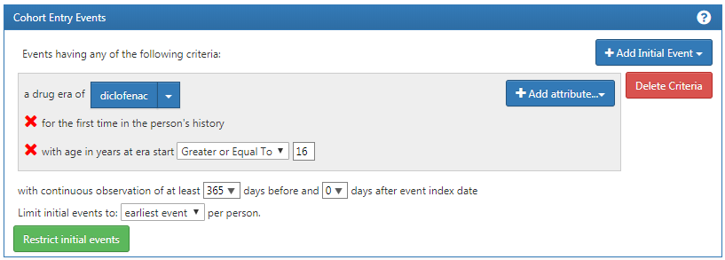

디클로페낙의 concept 세트 표현은 그림 \@ref(fig:cohortsAtlasConceptSet1)과 비슷해야 할 것이며, '디클로페낙' 성분과 '디클로페낙'의 모든 하위요소도 모두 포함하여 디클로페낙 성분이 포함된 모든 약물을 포함한다.


다음으로, 그림 \@ref(fig:cohortsAtlasInclusion1)에서 보이는 것과 같이, 모든 NSAID에 대한 이전의 노출이 없는 것을 필요로 한다.

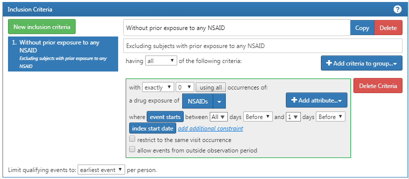

NSAID의 concept 세트 표현은 그림 \@ref(fig:cohortsAtlasConceptSet2)와 비슷해야 할 것이며, NSAID 클래스와 NSAID의 모든 하위요소도 모두 포함하여 NSAID이 포함된 모든 약물을 포함한다.

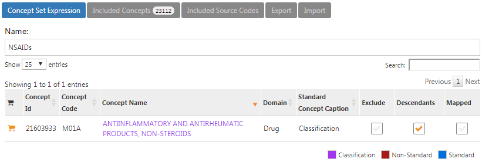

추가적으로, 그림 \@ref(fig:cohortsAtlasInclusion2)에서 보이는 것과 같이, 이전의 암 증상이 없는 것을 필요로 한다.

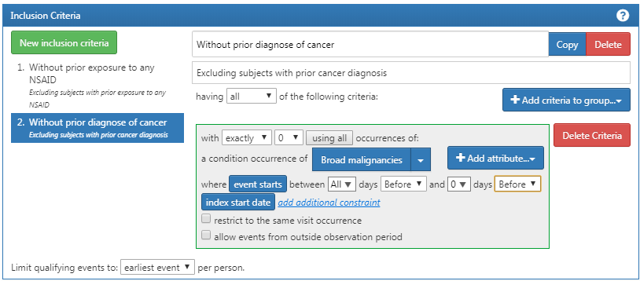

"Broad malignancies"의 concept 세트 표현은 그림 \@ref(fig:cohortsAtlasConceptSet3)와 비슷해야 할 것이며, 고 레벨 concept의 "Malignant neoplastic disease"와 그의 모든 하위요소도 포함해야 한다.


마지막으로, 그림 \@ref(fig:cohortsAtlasExit)에서 보이는 것과 같이, 코호트 종료 기준을 노출의 중단 (30일 간격 허용) 으로 정의한다.

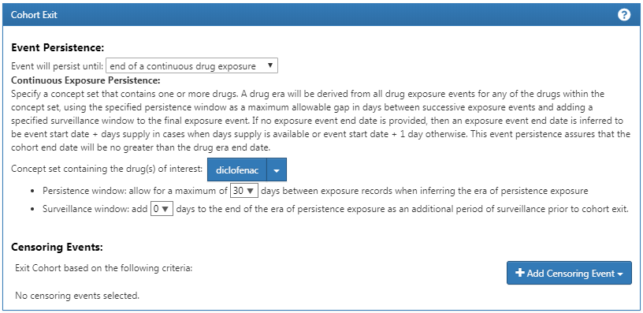

#### 예제 \@ref(exr:exerciseCohortsSql) {-}

가독성을 위하여 SQL을 두 개의 과정으로 나누었다. 첫 번째로, 심근경색의 모든 증상 발생을 찾고, 이를 "#diagnoses"로 불리는 임시 테이블에 저장한다:


```r
library(DatabaseConnector)
connection <- connect(connectionDetails)
sql <- "SELECT person_id AS subject_id,
  condition_start_date AS cohort_start_date
INTO #diagnoses
FROM @cdm.condition_occurrence
WHERE condition_concept_id IN (
    SELECT descendant_concept_id
    FROM @cdm.concept_ancestor
    WHERE ancestor_concept_id = 4329847 -- Myocardial infarction
)
  AND condition_concept_id NOT IN (
    SELECT descendant_concept_id
    FROM @cdm.concept_ancestor
    WHERE ancestor_concept_id = 314666 -- Old myocardial infarction
);"

renderTranslateExecuteSql(connection, sql, cdm = "main")
```

그리고 몇몇의 특별한 COHORT_DEFINITION_ID (우리는 '1'을 선택하였다) 를 사용하여 입원 중이거나 응급실에 방문한 환자들에게 일어난 것만 선택한다:


```r
sql <- "INSERT INTO @cdm.cohort (
  subject_id, 
  cohort_start_date, 
  cohort_definition_id
  )
SELECT subject_id,
  cohort_start_date,
  CAST (1 AS INT) AS cohort_definition_id
FROM #diagnoses
INNER JOIN @cdm.visit_occurrence
  ON subject_id = person_id
    AND cohort_start_date >= visit_start_date
    AND cohort_start_date <= visit_end_date
WHERE visit_concept_id IN (9201, 9203, 262); -- Inpatient or ER;"

renderTranslateExecuteSql(connection, sql, cdm = "main")
```

대체 접근 방식은 방문 시작과 종료 날짜 사이에 부합하는 condition 날짜를 요구하는 대신, VISIT_OCCURRENCE_ID에 근거하여 방문의 condition에 조인한 적이 있을 수도 있음을 명심한다. 이는 입원 혹은 응급실 방문과 관련되어 condition 기록되었음을 보장하기 때문에 더 정확할 수 있다. 하지만, 많은 관찰 데이터베이스는 방문과 증상의 관계를 기록하지 않고, 그러므로 날짜를 대신 사용하는 것을 선택하여, 아마 낮은 특이도일 수 있으나 높은 민감도를 줄 수도 있다.

또한 코호트 종료 날짜를 무시했다는 것을 명심한다. 종종, 결과를 정의하기 위해 코호트가 사용되었을 때 우리는 코호트 시작 날짜만 염두하고, (병명이 정의된) 코호트 종료 날짜를 생성하는 것은 의미가 없다.

임시 테이블은 더는 필요가 없다면 정리하는 것을 추천한다:


```r
sql <- "TRUNCATE TABLE #diagnoses;
DROP TABLE #diagnoses;"

renderTranslateExecuteSql(connection, sql)
```


## 임상적 특성 분석 {#Characterizationanswers}

#### 예제 \@ref(exr:exerciseCharacterization1) {-}

아틀라스에서 를 클릭하고, 관심 있는 데이터 원천을 선택한다. 약물 노출 기록을 선택할 수 있고, "Table" 탭을 선택할 수 있으며, 그림 \@ref(fig:dataSourcesAtlas)과 같이 "celecoxib"를 찾을 수 있다. 여기에서 이 특정한 데이터베이스가 celecoxib의 다양한 제형들의 노출을 포함하는 것을 볼 수 있다. 더욱 자세히 보기 위해서는 여기에서의 아무 약물을 클릭할 수 있다. 예를 들어, 이 약물에 대한 나이나 성별 분포를 나타내기 위함이다.

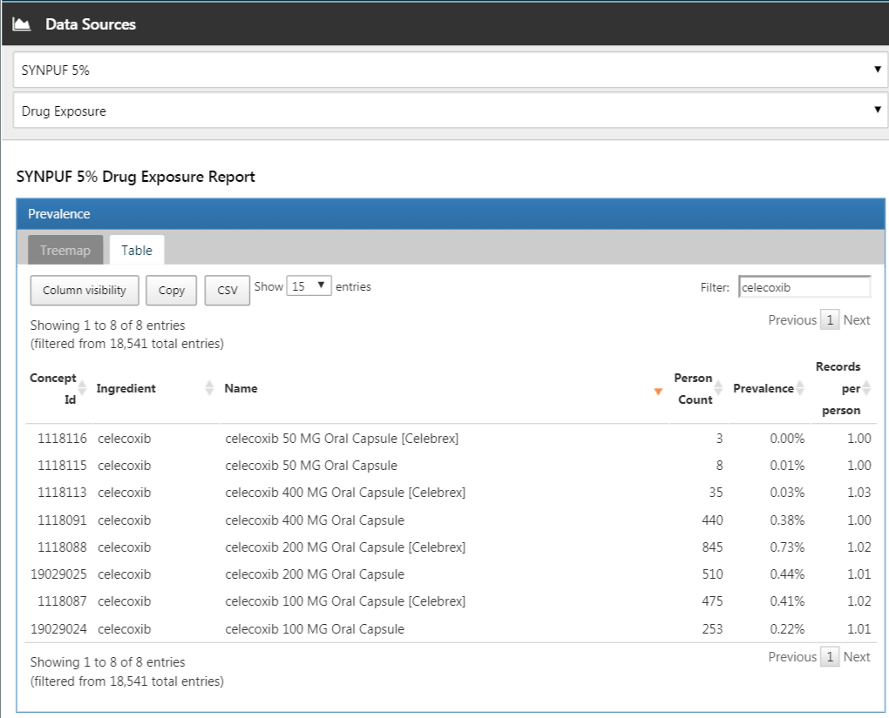


#### 예제 \@ref(exr:exerciseCharacterization2) {-}

를 클릭하고 새로운 코호트를 생성하기 위해 "New cohort"를 클릭한다. 코호트에 의미 있는 이름을 부여하고 (예를 들어, "Celecoxib new users"가 있다) "Concept Sets" 탭으로 이동한다. "New Concept Set"를 클릭하고, concept 세트에 의미있는 이름을 부여한다 (예를 들어, "Celecoxib").  모듈을 열고, "celecoxib"를 검색하여, 클래스를 "Ingredient"로, 표준 concept을 "Standard"로 제한한 후, 그림 \@ref(fig:conceptSearchAtlas)와 같이 concept을 당신의 concept 세트에 추가하기 위해 를 클릭한다.

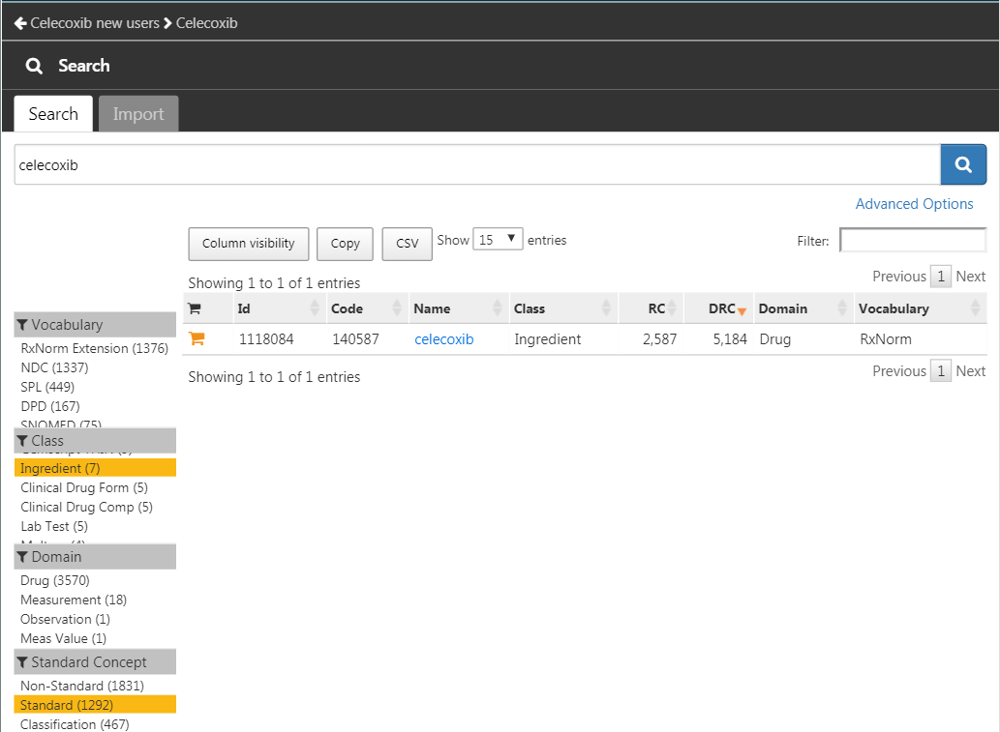

코호트 정의로 돌아가기 위해서는 그림 \@ref(fig:conceptSearchAtlas)의 상위 왼편에 보이는 왼쪽 화살표를 클릭한다. "+Add Initial Event"를 클릭한 후 "Add Drug Era"를 클릭한다. 이미 생성된 약물 범위 기준의 concept 세트를 선택한다. "Add attribute..."를 클릭하고 "Add First Exposure Criteria."를 선택한다. 발생 시점 전으로부터 최소 365일이 요구되는 지속적인 관찰을 설정한다. 결과는 그림 \@ref(fig:celecoxibCohortDefinition)와 비슷해야 한다. 포함 기준, 코호트 종료, 코호트 범위 세션을 그대로 두고 나간다. 를 클릭하여 코호트 정의를 저장하고, 를 클릭하여 확실히 닫는다.

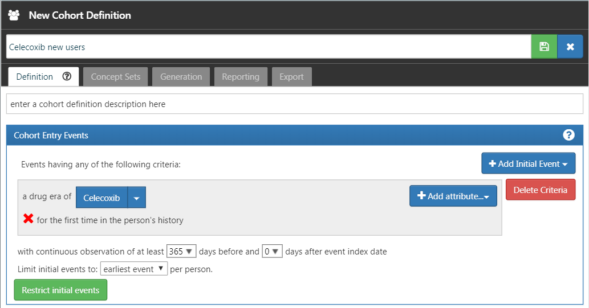

이제 코호트가 정의 되었으니, 특성화 할 수 있다. 를 클릭한 후 "New Characterization"를 클릭한다. 임상적 특성에 의미있는 이름을 부여한다 (예를 들어, "Celecoxib 새 사용자의 임상적 특성"). 코호트 정의 아래에, "Import"를 클릭하고 최근에 생성한 코호트 정의를 선택한다. "Feature Analyses" 아래에, "Import"를 클릭한 후 최소 하나의 condition 분석과 하나의 약물 분석을 선택한다. 예를 들면 "Drug Group Era Any Time Prior"와 "Condition Group Era Any Time Prior"이다. 임상적 특성 정의는 그림 \@ref(fig:celecoxibCharacterization)와 비슷해야 한다. 를 클릭하여 임상적 특성 설정을 확실히 저장한다.

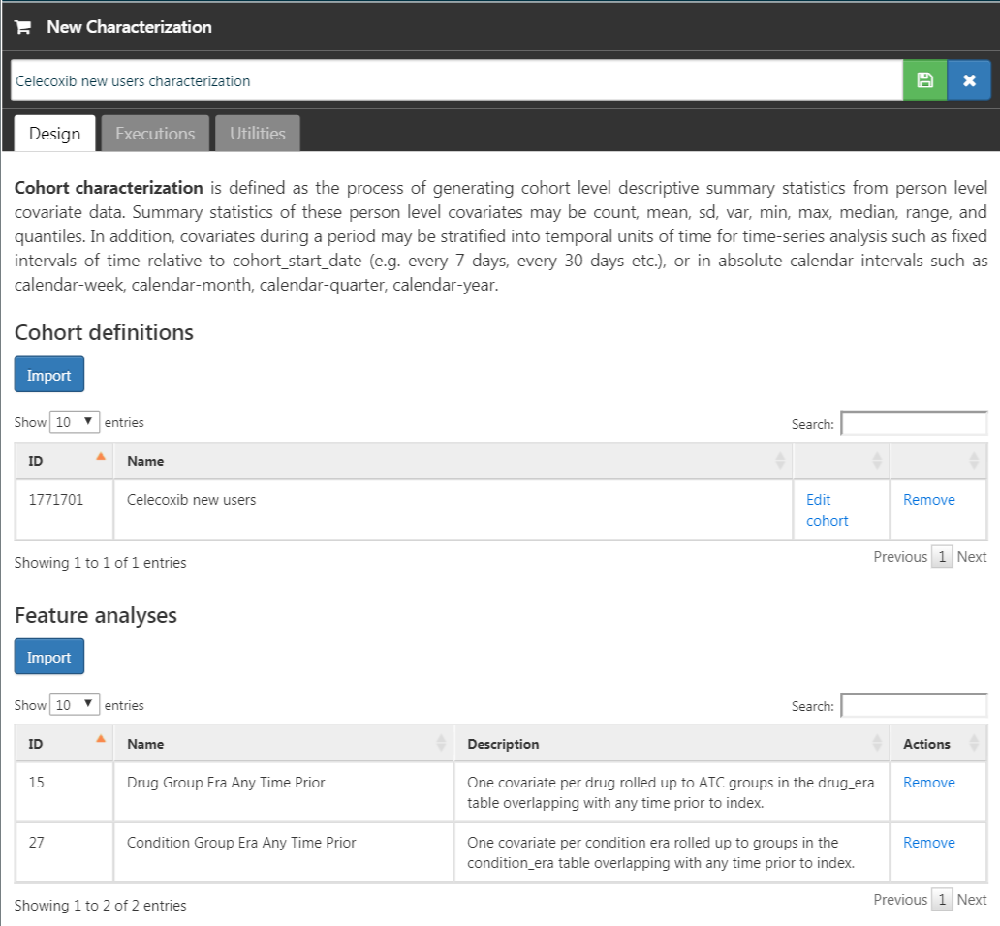

"Exections" 탭을 클릭한 후, 데이터 원천 중의 하나로 "Generate"를 클릭한다. 생성이 끝날 때까지 시간이 걸릴 수 있다. 끝나면, "View latest results"를 클릭할 수 있다. 결과 화면은 그림 \@ref(fig:celecoxibCharacterizationResults)와 비슷하고, 이는 예를 들어 고통과 arthropathy가 흔히 관찰되는 것으로 보여지는데, 이는 celecoxib의 조짐이므로 놀랄만한 사용은 아니다. 목록의 아레쪽에 기대하지 않은 conditions이 보일 수 있다.

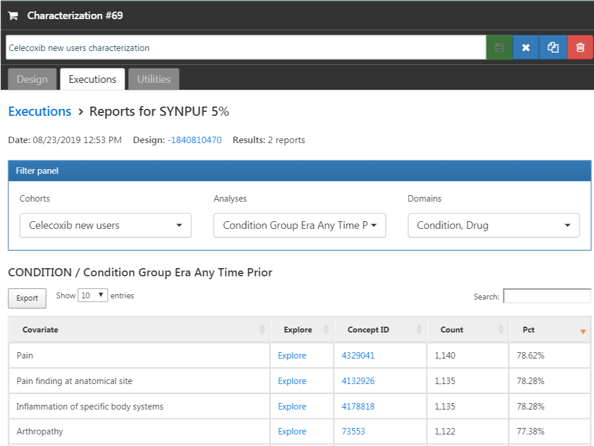

#### 예제 \@ref(exr:exerciseCharacterization3) {-}

를 클릭한 후 새로운 코호트를 생성하기 위해 "New cohort"를 클릭한다. 코호트에 의미있는 이름을 부여한다 (예를 들어 "GI bleed").  모둘을 열고, "Gastrointestinal hemorrhage"를 검색한 후, 그림 \@ref(fig:giBleedSearch)와 같이 concept을 당신의 concept 세트에 추가하기 위해 상위 concept 옆의 를 클릭한다.

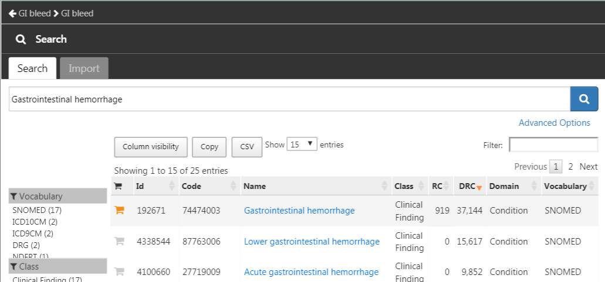

당신의 코호트 정의로 돌아가기 위해서는 그림 \@ref(fig:giBleedSearch)의 상위 왼쪽에 위치한 왼쪽 화살표를 클릭한다. "Concept Sets" 탭을 다시 열고, GI hemorrhage concept 옆에 있는 "Descendants"를 그림 \@ref(fig:giBleedDescendants)처럼 체크한다.


"Definition" 탭으로 돌아간 후, "+Add Initial Event"를 클릭하고, "Add Condition Occurrence"를 클릭한다. 이전에 생성한 condition 발생 기준의 concept 세트를 선택한다. 결과는 \@ref(fig:giBleedCohortDefinition)와 비슷해야 한다. 포함 기준, 코호트 종료, 코호트 범위 세션을 그대로 두고 나간다. 를 클릭하여 코호트 정의를 저장하고, 를 클릭하여 확실히 닫는다.

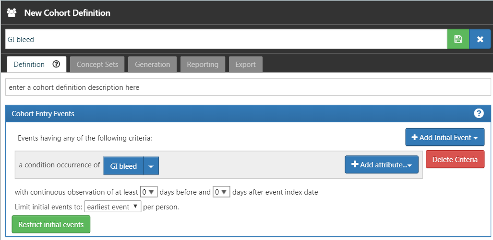

이제 코호트가 정의 되었으면, 발생률을 계산할 수 있다. 를 클릭하고, "New Analysis"를 클릭한다. 분석에 의미있는 이름을 부여한다 (예를 들어 "Incidence of GI bleed after celecoxib initiation"). "Add Target Cohort"를 클릭한 후 celecoxib 새로운 사용자 코호트를 선택한다. "Add Outcome Cohort"를 클릭한 후 새로운 GI bleed 코호트를 추가한다. 위험 노출 기간을 시작일 이후로 1095일이 지난 시점을 종료일로 지정한다. 분석은 그림 \@ref(fig:irAnalysis)과 비슷해야 한다. 를 클릭해서 분석 설정을 확실히 저장한다.

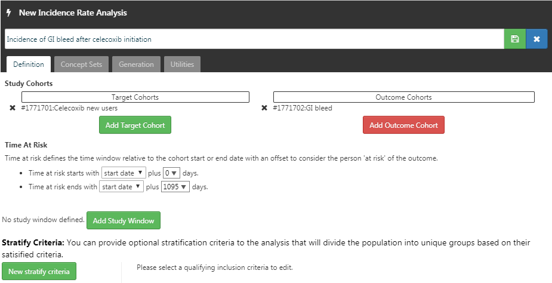

"Generation" 탭을 클릭한 후, "Generate"를 클릭한다. 데이터 원천 중 하나를 선택하고 "Generate"를 클릭한다. 끝났다면, 그림 \@ref(fig:irResults)에 보이는 것과 같이 계산된 발생률과 분율을 볼 수 있다.


## 인구 수준 추정 {#Pleanswers}

#### 예제 \@ref(exr:exercisePle1) {-}

공변량의 기본 세트를 명시하고 있지만, 반드시 비교하는 두 개의 약물은 제외하고, 그것의 하위호환은 포함해야 한다. 그렇지 않으면 성향 모델은 완벽하게 예측이 가능해질 것이다:


```r
library(CohortMethod)
nsaids <- c(1118084, 1124300) # celecoxib, diclofenac
covSettings <- createDefaultCovariateSettings(
  excludedCovariateConceptIds = nsaids,
  addDescendantsToExclude = TRUE)

# Load data:
cmData <- getDbCohortMethodData(
  connectionDetails = connectionDetails,
  cdmDatabaseSchema = "main",
  targetId = 1,
  comparatorId = 2,
  outcomeIds = 3,
  exposureDatabaseSchema = "main",
  exposureTable = "cohort",
  outcomeDatabaseSchema = "main",
  outcomeTable = "cohort",
  covariateSettings = covSettings)
summary(cmData)
```

```
## CohortMethodData object summary
## 
## Treatment concept ID: 1
## Comparator concept ID: 2
## Outcome concept ID(s): 3
## 
## Treated persons: 1800
## Comparator persons: 830
## 
## Outcome counts:
##   Event count Person count
## 3         479          479
## 
## Covariates:
## Number of covariates: 389
## Number of non-zero covariate values: 26923
```

#### 예제 \@ref(exr:exercisePle2) {-}

사양 specification 을 따르는 인구 모집단을 생성하고, 소모 도표를 출력한다:


```r
studyPop <- createStudyPopulation(
  cohortMethodData = cmData,
  outcomeId = 3,
  washoutPeriod = 180,
  removeDuplicateSubjects = "remove all",
  removeSubjectsWithPriorOutcome = TRUE,
  riskWindowStart = 0,
  startAnchor = "cohort start",
  riskWindowEnd = 99999)
drawAttritionDiagram(studyPop)
```
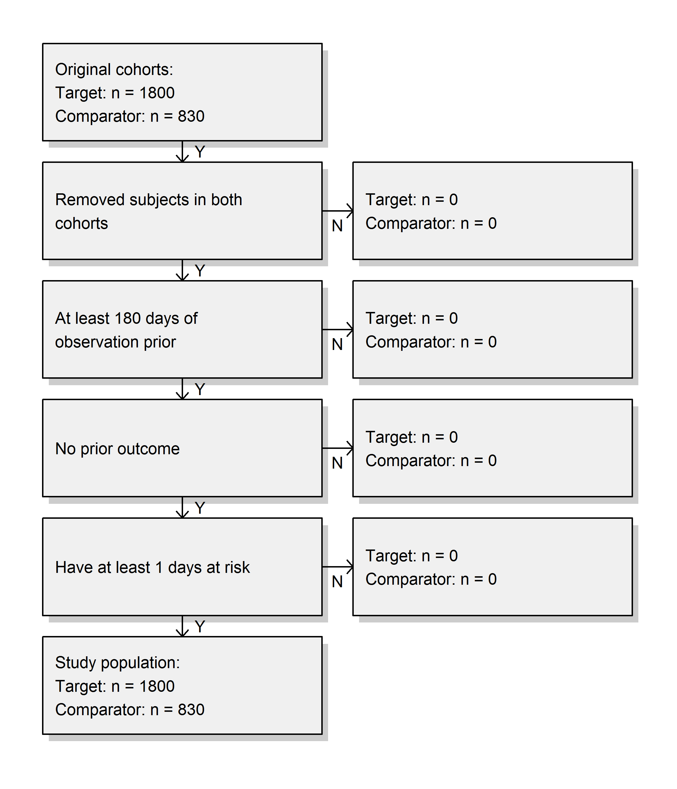<!-- -->

기존의 코호트와 비교하여 어떤 대상도 잃지 않은 것을 볼 수 있는데, 아마도 왜냐하면 여기서 사용한 제한이 이미 코호트 정의에서 사용된 것이기 때문이다.

#### 예제 \@ref(exr:exercisePle3) {-}

콕스 회귀를 사용하여 간단한 결과 모델을 적합한다:


```r
model <- fitOutcomeModel(population = studyPop,
                         modelType = "cox")
model
```

```
## Model type: cox
## Stratified: FALSE
## Use covariates: FALSE
## Use inverse probability of treatment weighting: FALSE
## Status: OK
## 
##           Estimate lower .95 upper .95   logRr seLogRr
## treatment  1.34612   1.10065   1.65741 0.29723  0.1044
```

celecoxib 사용자가 diclofenac 사용자와 교환될 수 없고, 이 기저 차이는 이미 다른 결과의 위험으로 이어질 가능성이 있다. 이 차이를 조절하지 않으면, 이 분석과 같이 편향된 측정을 생성할 가능성이 있다.

#### 예제 \@ref(exr:exercisePle4) {-}

추출한 모든 공변량을 사용하여 연구 모집단에 성향 모델을 적합했다. 그 후 선호 점수 분포도를 보여준다:


```r
ps <- createPs(cohortMethodData = cmData,
               population = studyPop)
plotPs(ps, showCountsLabel = TRUE, showAucLabel = TRUE)
```
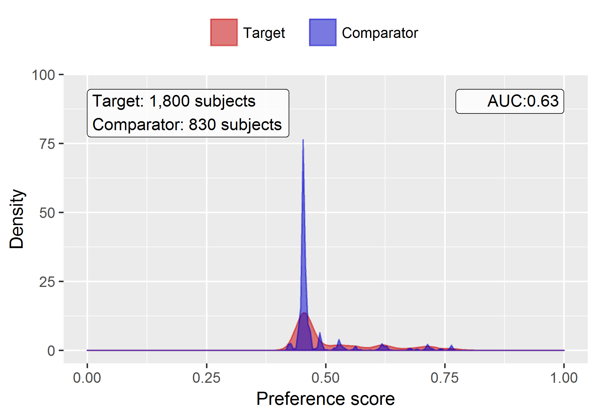<!-- -->

몇 개의 spike가 있는 이 분포가 조금 이상해 보일 수 있다. 왜냐하면 시뮬레이션 된 정말 작은 데이터 세트를 사용하기 때문이다. 실제의 선호 점수 분포는 더 매끄러운 경향이 있다.

성향 모델은 0.63의 AUC를 달성하는데, target과 comparator 코호트 간의 차이가 있다는 것을 제안한다. PS 조정이 그들을 더욱 비교할 수 있게 함을 시사하는 두 집단 간의 꽤 많은 교차를 볼 수 있다.


#### 예제 \@ref(exr:exercisePle5) {-}

모집단을 성향 점수에 근거하여 계층화하고, 층화 전과 후의 공변량 균형을 계산한다:


```r
strataPop <- stratifyByPs(ps, numberOfStrata = 5)
bal <- computeCovariateBalance(strataPop, cmData)
plotCovariateBalanceScatterPlot(bal, 
                                showCovariateCountLabel = TRUE, 
                                showMaxLabel = TRUE, 
                                beforeLabel = "Before stratification", 
                                afterLabel = "After stratification")
```
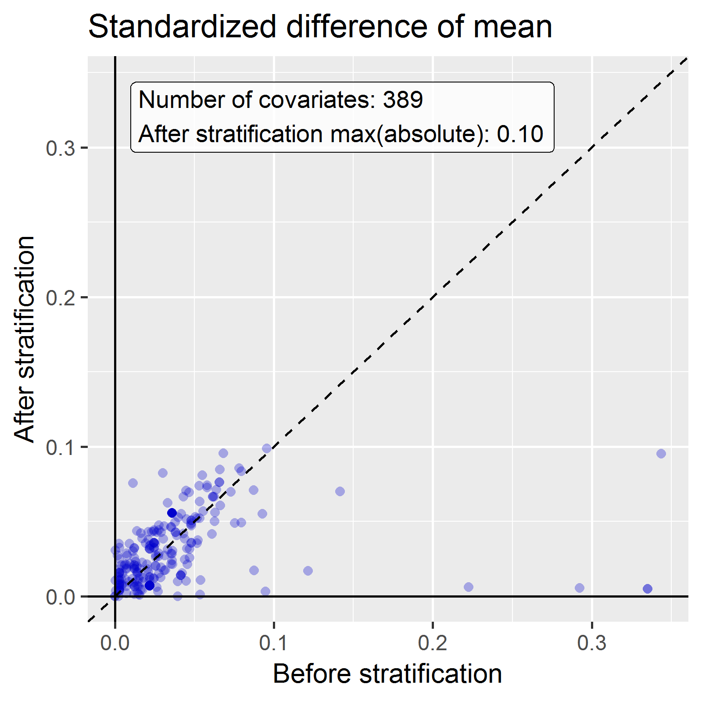<!-- -->

다양한 기저 공변량은 층화 전의 (x-axis) 큰 (>0.3) 표준화된 평균의 차이를 보여준다. 층화 후에, 최대 표준화 차이 <= 0.1와 같이 균형은 상승된다.

#### 예제 \@ref(exr:exercisePle6) {-}

콕스 회귀를 사용하여 결과 모델을 적합하나 PS strata로 계층화한다:


```r
adjModel <- fitOutcomeModel(population = strataPop,
                         modelType = "cox",
                         stratified = TRUE)
adjModel
```

```
## Model type: cox
## Stratified: TRUE
## Use covariates: FALSE
## Use inverse probability of treatment weighting: FALSE
## Status: OK
## 
##           Estimate lower .95 upper .95   logRr seLogRr
## treatment  1.13211   0.92132   1.40008 0.12409  0.1068
```

조정된 추정치는 조정되지 않은 추청지보다 낮고, 95% 신뢰 구간은 현재 1을 포함하는 것을 볼 수 있다. 왜냐하면 현재 두 개의 노출 집단, 즉 감소하는 비뚤림 사이의 기저 차이를 조절하는 중이기 때문이다.


## 환자 수준 예측 {#Plpanswers}

#### 예제 \@ref(exr:exercisePlp1) {-}

공변량 설정의 세트를 지정하고, `getPlpData` 기능을 데이터베이스에서 데이터를 추출하기 위해 사용한다:


```r
library(PatientLevelPrediction)
covSettings <- createCovariateSettings(
  useDemographicsGender = TRUE,
  useDemographicsAge = TRUE,
  useConditionGroupEraLongTerm = TRUE,
  useConditionGroupEraAnyTimePrior = TRUE,
  useDrugGroupEraLongTerm = TRUE,
  useDrugGroupEraAnyTimePrior = TRUE,
  useVisitConceptCountLongTerm = TRUE,
  longTermStartDays = -365,
  endDays = -1)

plpData <- getPlpData(connectionDetails = connectionDetails,
                      cdmDatabaseSchema = "main",
                      cohortDatabaseSchema = "main",
                      cohortTable = "cohort",
                      cohortId = 4,
                      covariateSettings = covSettings,
                      outcomeDatabaseSchema = "main",
                      outcomeTable = "cohort",
                      outcomeIds = 3)

summary(plpData)
```

```
## plpData object summary
## 
## At risk cohort concept ID: -1
## Outcome concept ID(s): 3
## 
## People: 2630
## 
## Outcome counts:
##   Event count Person count
## 3         479          479
## 
## Covariates:
## Number of covariates: 245
## Number of non-zero covariate values: 54079
```

#### 예제 \@ref(exr:exercisePlp2) {-}

관심 결과의 연구 모집단을 생성하고 (이 경우에는 추출한 데이터의 유일한 결과만), 364일의 위험 노출 시간을 필요로 하며, NSAID를 시작하기 전의 결과를 경험한 피험자를 제거한다:


```r
population <- createStudyPopulation(plpData = plpData,
                                    outcomeId = 3,
                                    washoutPeriod = 364,
                                    firstExposureOnly = FALSE,
                                    removeSubjectsWithPriorOutcome = TRUE,
                                    priorOutcomeLookback = 9999,
                                    riskWindowStart = 1,
                                    riskWindowEnd = 365,
                                    addExposureDaysToStart = FALSE,
                                    addExposureDaysToEnd = FALSE,
                                    minTimeAtRisk = 364,
                                    requireTimeAtRisk = TRUE,
                                    includeAllOutcomes = TRUE)
nrow(population)
```

```
## [1] 2578
```

이 경우에 사전의 결과를 가진 피험자를 제거하고, 최소 364일의 위험 노출 기간을 요구하기 때문에 몇 사람들을 잃게 된다.

#### 예제 \@ref(exr:exercisePlp3) {-}

먼저 모델 설정 객체를 만든 후에, `runPlp` 기능을 호출함으로써 LASSO 모델을 실행한다. 이 경우에는 person split을 행하고, 75%의 데이터를 모델에 학습시키며, 25%의 데이터로 평가한다:


```r
lassoModel <- setLassoLogisticRegression(seed = 0)

lassoResults <- runPlp(population = population, 
                       plpData = plpData, 
                       modelSettings = lassoModel, 
                       testSplit = 'person',
                       testFraction = 0.25, 
                       nfold = 2, 
                       splitSeed = 0)
```

이 예시에서는 LASSO 교차 검증과 학습-검증 데이터 분할을 위한 무작위 seed를 지정하여 여러 번 실행해도 결과가 동일한지 확인한다.

Shiny 앱을 사용하여 결과를 볼 수 있다:


```r
viewPlp(lassoResults)
```

이것은 그림 \@ref(fig:plpShiny)에서 보이는 것과 같이 앱을 실행할 것이다. 여기 0.645의 테스트 세트의 AUC가 있는데 이는 무작위 추측보다 더 나을 수 있으나 임상적 실천에는 충분하지 않을 것이다.

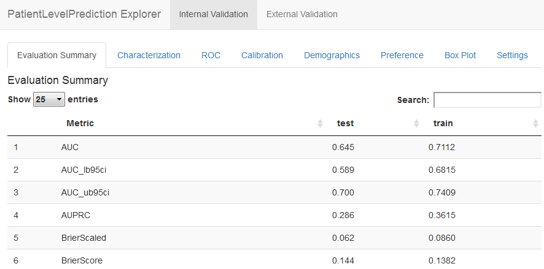


## 데이터의 질 {#DataQualityanswers}

#### 예제 \@ref(exr:exerciseRunAchilles) {-}

ACHILLES을 실행하기 위해서는:


```r
library(ACHILLES)
result <- achilles(connectionDetails,
                   cdmDatabaseSchema = "main",
                   resultsDatabaseSchema = "main",
                   sourceName = "Eunomia",
                   cdmVersion = "5.3.0")
```

#### 예제 \@ref(exr:exerciseRunDQD) {-}

데이터의 질 Dashboard를 실행하기 위해서는:


```r
DataQualityDashboard::executeDqChecks(
  connectionDetails, 
  cdmDatabaseSchema = "main", 
  resultsDatabaseSchema = "main",
  cdmSourceName = "Eunomia",
  outputFolder = "C:/dataQualityExample") 
```

#### 예제 \@ref(exr:exerciseViewDQD) {-}

데이터의 질 검사 목록을 보기 위해서는:


```r
DataQualityDashboard::viewDqDashboard(
  "C:/dataQualityExample/Eunomia/results_Eunomia.json") 
```
